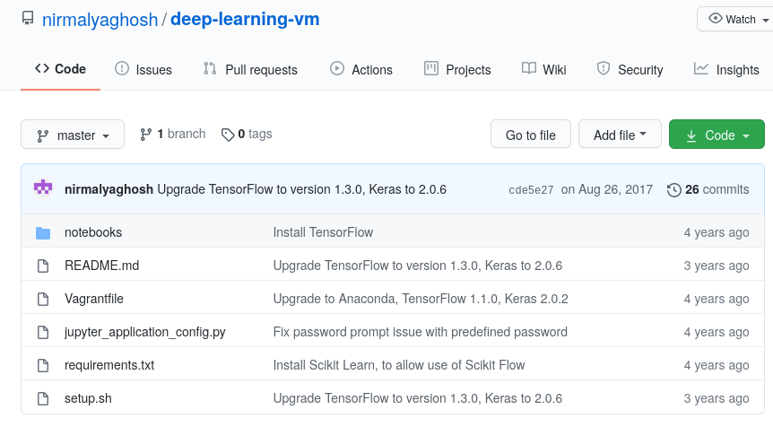
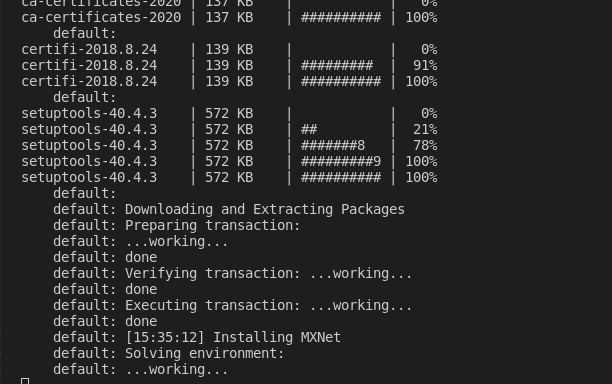
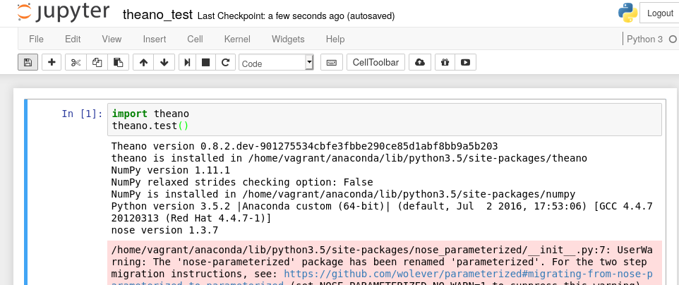
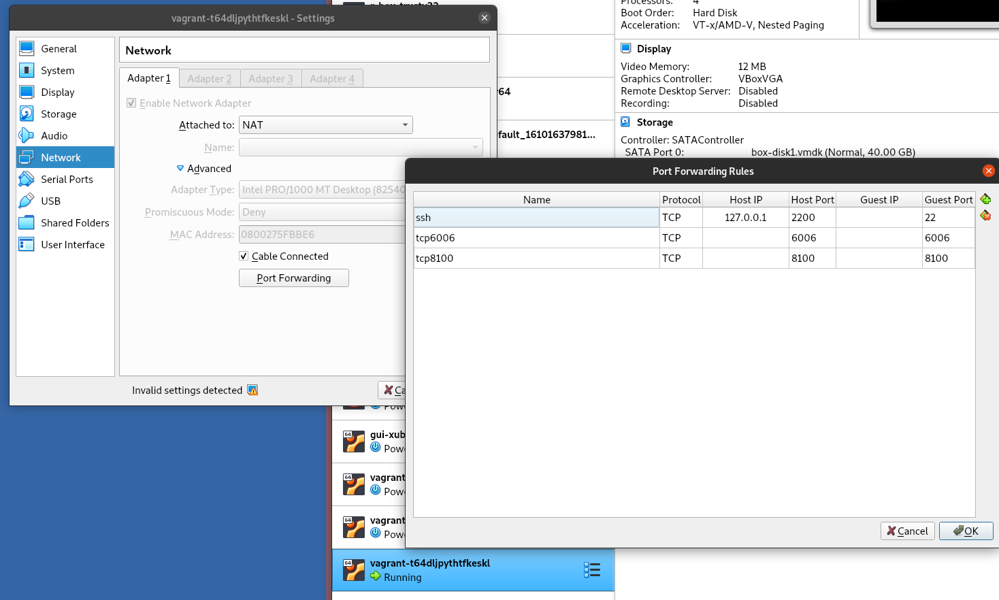

## Features

*  Original source: https://github.com/nirmalyaghosh/deep-learning-vm

* Uses Python Anaconda3
* Keras 2.0.6
* TensorFlow 1.3
* Jupyter access with password copying config file
* Vagrant box: `ubuntu/trusty64`
* Provisioning of Theano, h5py, MxNet, numpy, pandas, scipy
* Function test for theano takes about 2 hours in VM
* No mxnet (doesn't install)
* No PyTorch (in separate VM)


## Jupyter access
Start the VM with:

```
vagrant up
```

Open your browser at http://http://localhost:8100

When asked for a password, enter `password`


## Provisioning

### Copy files:

```
 config.vm.provision "file", source: "requirements.txt", destination: "/home/vagrant/requirements.txt"
  config.vm.provision :shell, path: 'setup.sh', keep_color: true
  config.vm.provision "file", source: "jupyter_application_config.py", destination: "/home/vagrant/jupyter_notebook_config.py"
```


## Install mxnet

```
 conda install -c anaconda mxnet 
```


### Scripts

```
config.vm.provision "shell", run: "always", inline: <<-SHELL
    /home/vagrant/anaconda/bin/jupyter notebook --notebook-dir=/home/vagrant/notebooks --port 8100 --ip=0.0.0.0 --config=/home/vagrant/jupyter_notebook_config.py &
  SHELL
```





## Getting stuck installing `mxnet`

```
chown -R vagrant:vagrant /home/vagrant/anaconda
# /home/vagrant/anaconda/bin/conda install -c pjmtdw mxnet=0.10.0
/home/vagrant/anaconda/bin/conda install -c anaconda py-mxnet
```





Same problem with:

```
/home/vagrant/anaconda/bin/conda install -c anaconda mxnet
```


## Some warnings during `theano` long test

Completes the run but with many warnings:




```
/home/vagrant/anaconda/lib/python3.5/site-packages/nose_parameterized/__init__.py:7: UserWarning: The 'nose-parameterized' package has been renamed 'parameterized'. For the two step migration instructions, see: https://github.com/wolever/parameterized#migrating-from-nose-parameterized-to-parameterized (set NOSE_PARAMETERIZED_NO_WARN=1 to suppress this warning)
  "The 'nose-parameterized' package has been renamed 'parameterized'. "
```

```
/home/vagrant/anaconda/lib/python3.5/site-packages/theano/misc/pycuda_init.py:34: UserWarning: PyCUDA import failed in theano.misc.pycuda_init
  warnings.warn("PyCUDA import failed in theano.misc.pycuda_init")
```


```
/home/vagrant/anaconda/lib/python3.5/site-packages/scipy/sparse/data.py:65: ComplexWarning: Casting complex values to real discards the imaginary part
  return self._with_data(self._deduped_data().astype(t))
/home/vagrant/anaconda/lib/python3.5/site-packages/theano/sparse/tests/test_basic.py:2351:
```

```
/home/vagrant/anaconda/lib/python3.5/site-packages/theano/tensor/signal/tests/test_pool.py:39: VisibleDeprecationWarning: using a non-integer number instead of an integer will result in an error in the future
  output_val = numpy.zeros(out_shp)
```

```
ERROR (theano.gof.opt): EquilibriumOptimizer max'ed out by 'local_upcast_elemwise_constant_inputs'. You can safely raise the current threshold of 5.000000 with the theano flag 'optdb.max_use_ratio'.
```

```
/home/vagrant/anaconda/lib/python3.5/unittest/case.py:600: DeprecationWarning: stack(*tensors) interface is deprecated, use stack(tensors, axis=0) instead.
  testMethod()
```

```
  home/vagrant/anaconda/lib/python3.5/site-packages/theano/tensor/tests/test_basic.py:7515: DeprecationWarning: This function is deprecated. Please call randint(3, 5 + 1) instead
  aiscal_val = randint(3, 5, size=())
```

```
4: DeprecationWarning: This function is deprecated. Please call randint(1, 50 + 1) instead
  a = np.random.random_integers(50, size=(25)).astype(dtype)
/home/vagrant/anaconda/lib/python3.5/site-packages/theano/tensor/tests/test_extra_ops.py:154: DeprecationWarning: This function is deprecated. Please call randint(1, 50 + 1) instead
  a = np.random.random_integers(50, size=(25)).astype(dtype)
```

```
9: DeprecationWarning: This function is deprecated. Please call randint(1, 5 + 1) instead
  5, size=a.size).astype(dtype)
/home/vagrant/anaconda/lib/python3.5/site-packages/theano/tensor/tests/test_extra_ops.py:454: DeprecationWarning: This function is deprecated. Please call randint(1, 10 + 1) instead
  r = np.random.random_integers(10, size=()).astype(dtype) + 2
```

```
/home/vagrant/anaconda/lib/python3.5/site-packages/theano/tensor/raw_random.py:578: DeprecationWarning: This function is deprecated. Please call randint(-5, 5 + 1) instead
  out[oi] = random_state.random_integers(low=low[li], high=high[hi])
```

```
/home/vagrant/anaconda/lib/python3.5/site-packages/theano/typed_list/tests/test_basic.py:36: DeprecationWarning: This function is deprecated. Please call randint(1, 1073741824 + 1) instead
  idx = numpy.random.random_integers(huge, size=2) % shape
```


```
/home/vagrant/anaconda/lib/python3.5/unittest/case.py:600: UserWarning: consider_constant() is deprecated, use zero_grad() or disconnected_grad() instead.
  testMethod()
./home/vagrant/anaconda/lib/python3.5/unittest/case.py:600: UserWarning: consider_constant() is deprecated, use zero_grad() or disconnected_grad() instead.
  testMethod()
```


## Network settings

